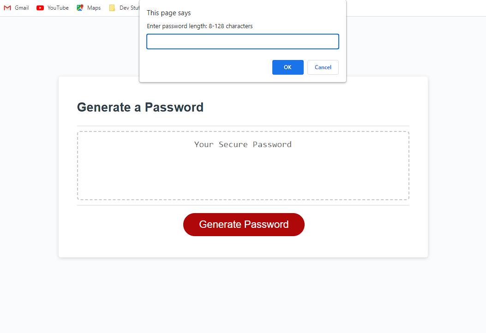

# Random Password Generator

## Description
A web app that generates a randomized string of characters for a secure password. User can select their password length, as well as which types of characters to use.

## Installation
n/a

## Usage
Simply press the 'Generate Password' button, and follow the prompts to customize your password length and strength. 

## Credits
N/A

## License

Please refer to the LICENSE in the repo.

---